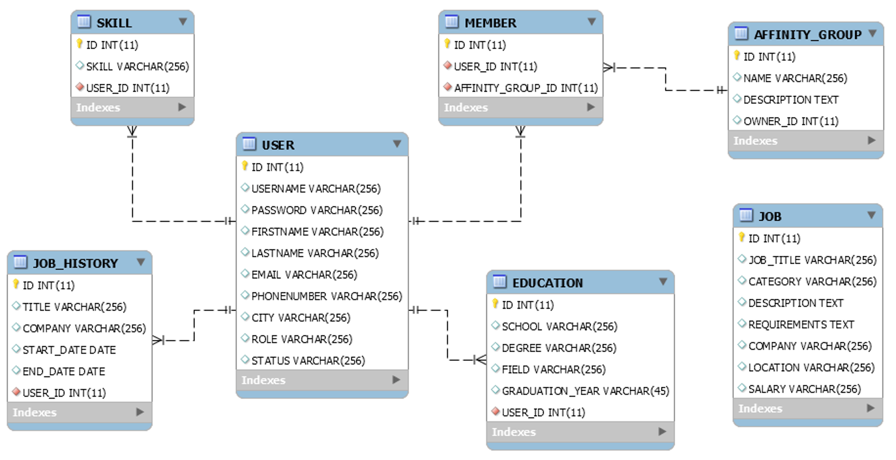
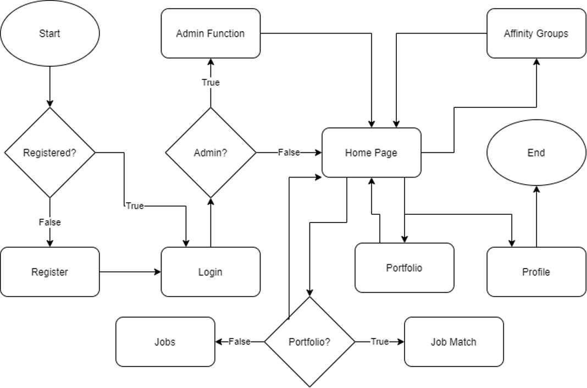
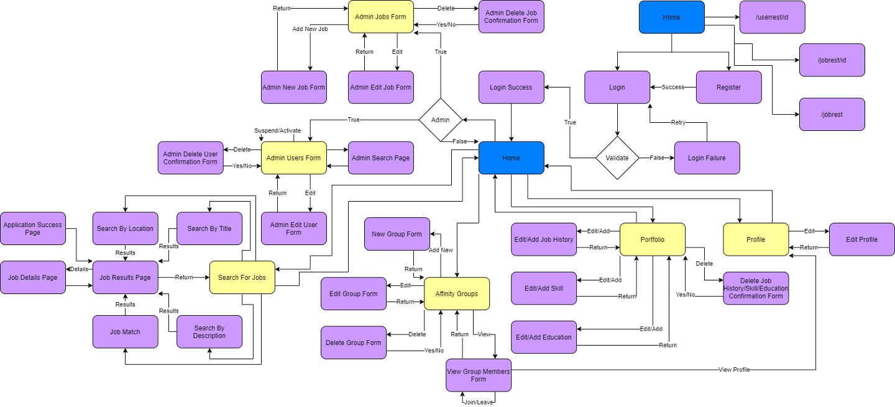
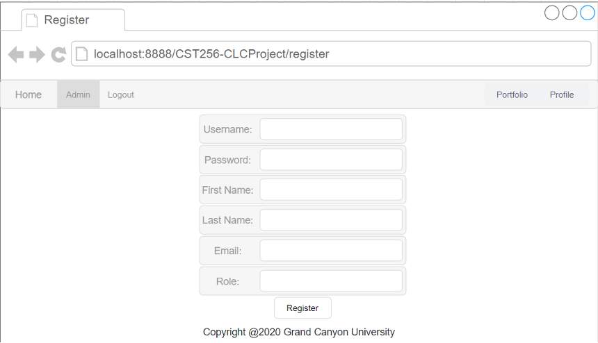
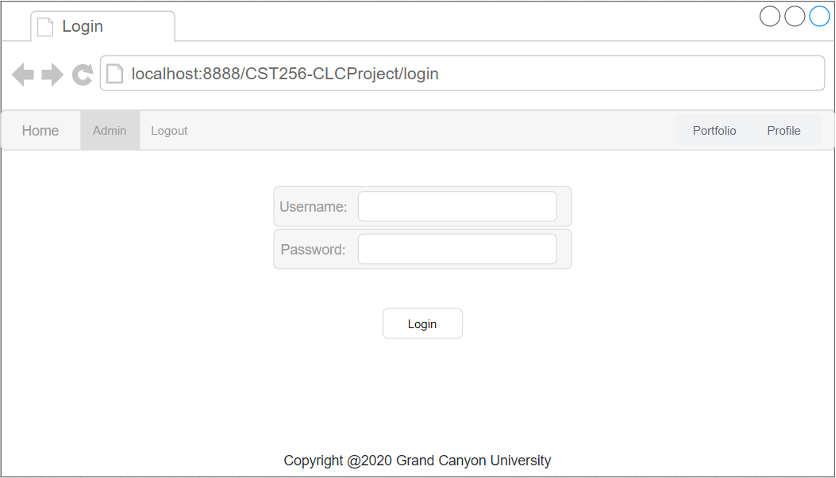
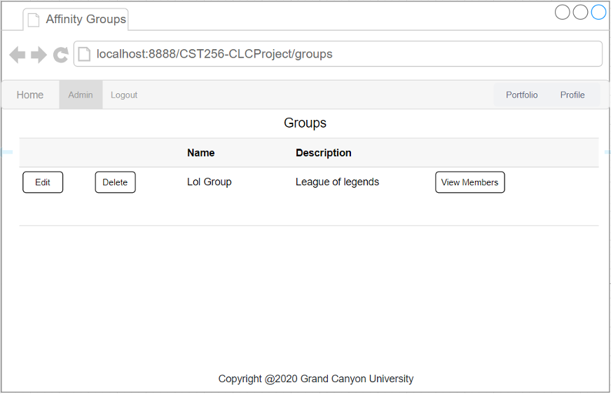
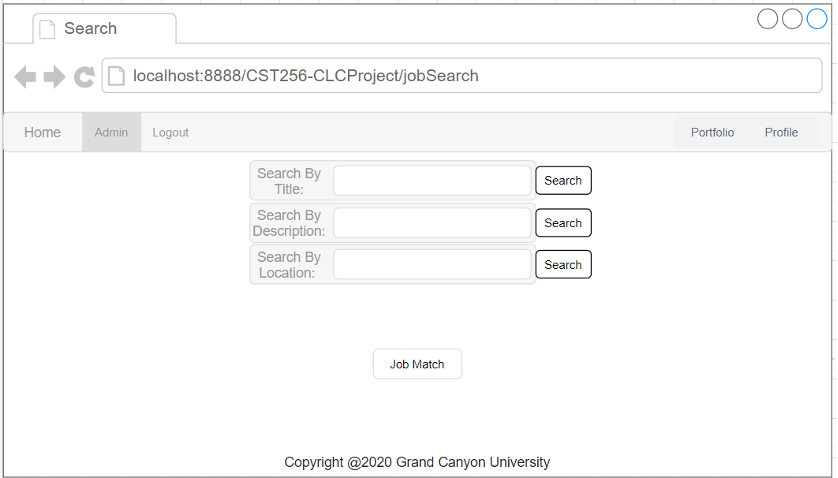
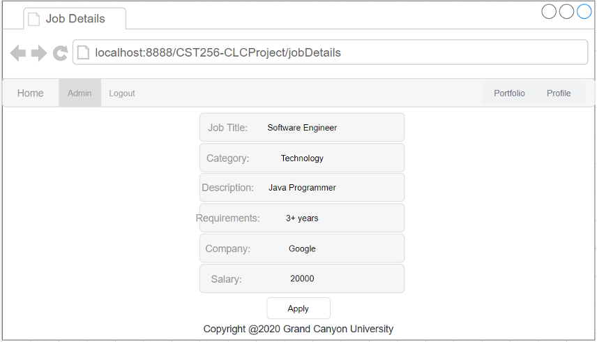

## StudentSocialApp

This project is a social web application for networking and career seeking using PHP Laravel framework to interact with MySQL and Azure cloud deployment

# Author:
 Thong Phan Tue Nguyen
 Adam Bender

# Technical Design
This project uses Laravel framework in PHP, MySQL for database design, Laravel Blade for front end and GitHub for collaboration

# ER Diagram

 
 

# DDL Script

CST256-CLCProject/Milestone7DDL.sql

# Flow Chart 

 
 

 
 # Sitemap
 
 

 
 

# Walkthrough
1. User needs to create an account to access the web app. An account includes first name, last name, username, password, email and role with option to be admin or normal user. 

 
 

2. User logins with created account through login form

 
 

3. User builds portfolio with job history, skills, and education in Portfolio page. User also have the option to edit and delete the listed field. 

 
 

4. User can join infinity groups to join group with shared interests and hobbies. 

 
 

5. User searches for a job with job title, description or location. Job Match button is the feature that automatically match user with a job that fits their skill and education. 

 
 

6. User views the matched job to consider their qualification and interests. The apply button will forward their information to the employee. 

 
 

# Hosting URL: 
https://cst256.azurewebsites.net/

# Github Repository 
https://github.com/abomb07/CST256-CLCProject.git
